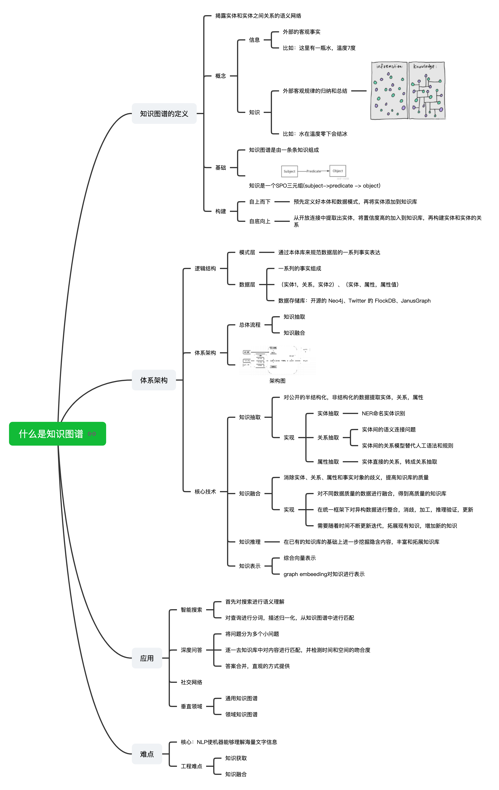

## 知识图谱

### 知识图谱基础

- [什么是知识图谱，知乎，比较好](https://zhuanlan.zhihu.com/p/71128505)
  
  

- [详细说明知识图谱](http://www.360doc.com/content/20/0525/00/43535834_914347385.shtml)
- [详细说明知识图谱](https://www.jiqizhixin.com/articles/2018-06-20-4)
- [知识图谱的schema，百度AI](https://ai.baidu.com/tech/kg/schema)
- [如何入门知识图谱](https://www.zhihu.com/question/52368821)

### 知识图谱的实现

- [Python实现知识图谱，具体代码实现](https://www.kaggle.com/nageshsingh/build-knowledge-graph-using-python)
- [知识图谱构建的实现](https://blog.csdn.net/qq_35273499/article/details/80259821)  
- 