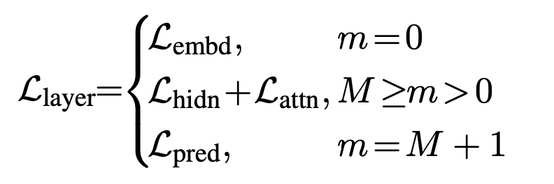

### Knowledge distillation

#### NLP distillation
- [TinyBERT](https://arxiv.org/pdf/1909.10351.pdf) and [code implement for TinyBERT](https://github.com/yinmingjun/TinyBERT)
  
  Main contribution[loss is output and median transformer differences]: 
  1. Use `teacher-student` framework to transfer knowledge from BERT to TinyBERT.
  2. 2-stage learning framework: general tiny transformers and task-specific transformers
  3. Do could achieve smiliar result compared to BERT with less parameters.

  Distill: 
  1. Transformer layer distill: Use $loss=MSE(H^S * W_h, H^T)$ to move tiny layer to be same as origin transformer layer.
  2. Embedding layer distill: Use $loss=MSE(E^S * W_e, H^T)$ same as transformer distill, but shape is same
  3. Prediction layer distill: Use cross-entropy to compute difference between `teacher` and `student` output.
  4. Final loss is combined these losses: 

  TinyBert的训练过程： - 1、用通用的Bert base进行蒸馏，得到一个通用的student model base版本； - 2、用相关任务的数据对Bert进行fine-tune得到fine-tune的Bert base模型； - 3、用2得到的模型再继续蒸馏得到fine-tune的student model base，注意这一步的student model base要用1中通用的student model base去初始化；（词向量loss + 隐层loss + attention loss） - 4、重复第3步，但student model base模型初始化用的是3得到的student模型。（任务的预测label loss）.

- [Chinese explain for KD](https://blog.csdn.net/HoyTra0/article/details/106238382)
- [how to distill in chinese](https://github.com/DA-southampton/NLP_ability/blob/master/深度学习自然语言处理/模型蒸馏/什么是知识蒸馏.md)
   
- [知识蒸馏基础，简单说明如何使用温度控制来保证学生模型学习老师模型,推荐](https://zhuanlan.zhihu.com/p/102038521?utm_source=wechat_timeline)

  核心：
  - 训练一个大的教师模型，定义一个小的学生模型（假设：模型的准确度不是随着参数变小而线性变化）
  - 对样本利用大模型进行预测，获取softmax概率（假设：概率大的负样本同时包含信息）
  - 对小模型进行样本学习，核心误差：soft loss 和 hard loss的加权值（soft loss是小模型同时输出softmax值来和大模型softmax值进行CE误差计算，hard loss是和大模型的预测结果直接计算误差，其实也可以使用logits直接计算soft loss）
  - 对误差进行反向学习来更新小模型的参数

- 